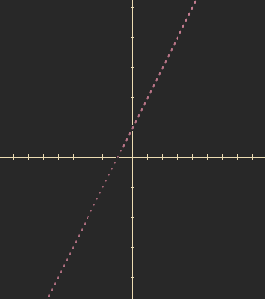

# Graphene

## A CLI program that functions as a simple graphing calculator


## Usage

Upon running a list of available functions will be shown:

### 1 - Linear
Graphs a line using the function - ```f(x) = mx + b```


###  2 - Quadratic
Graphs a parabola/quadratic using the function - ```f(x) = a(x-h)² + k```


###  3 - Sine Wave
Graphs a sine wave using the function - ```f(x) = a⋅sin(b(x-c)) + d```


###  4 - Tangent
Graphs a tangent using the function - ```f(x) = a⋅tan(bx)```


## Configuration

The color of any graphed function can be changed

The currently available colors are:

Red


Magenta



Blue


## Installation
Download and extract [Graphene.zip](Graphene.zip)
### GCC
Run ```gcc -o graphene graphene.c -lm``` to compile and ```./graphene``` to run
>Requires GCC
### PATH
the project directory can be added to ```PATH``` to make ```graphene``` exectuable globally
